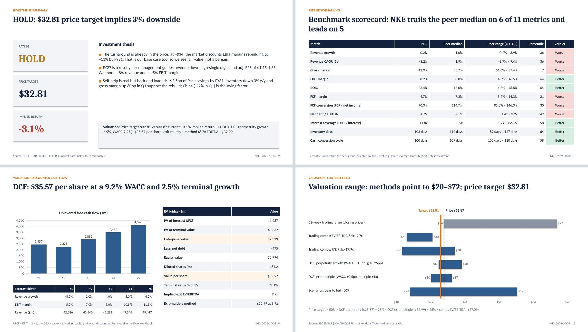
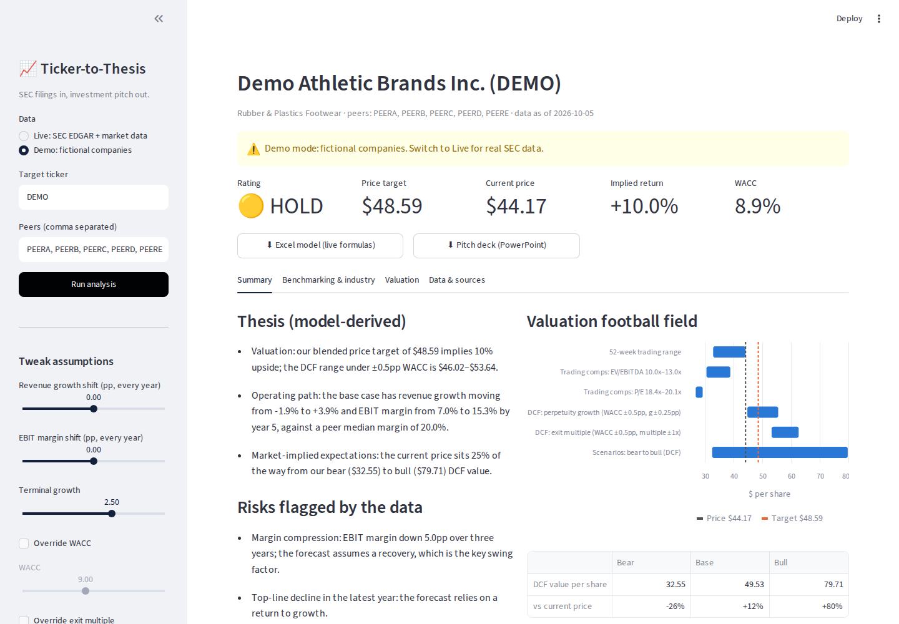

# Ticker-to-Thesis

**An automated equity research engine: SEC filings in, investment pitch out.**

Give it a US-listed ticker and a peer group. In about a minute it:

1. **pulls 5–8 years of audited financials** for every company straight from SEC EDGAR (XBRL), standardises them and records the exact filing behind each number;
2. **benchmarks the company against its peers and the industry trend**: growth, margins, ROIC, cash conversion, leverage and working capital, with percentile ranks and peer-median trends;
3. **values it**: a 5-year DCF with a bottom-up WACC, trading comps, bear/base/bull scenarios, sensitivity tables, a football field, a blended price target and a BUY / HOLD / SELL rating;
4. **writes the pitch materials**: a banker-style **Excel model with live formulas** and a **15-slide pitch deck** with native, editable charts.

A **Streamlit web app** puts all of this behind a ticker box, with sliders to stress the assumptions and download buttons for the model and the deck.

> **Live app:** _add your Streamlit link_ · **Showcase:** [Nike pitch deck (PDF)](examples/nike/NKE_2026-10-05_pitch_deck.pdf) · [Excel model](examples/nike/NKE_2026-10-05_valuation_model.xlsx) · [PowerPoint](examples/nike/NKE_2026-10-05_pitch_deck.pptx)

## Showcase: Nike (NKE), initiated at HOLD

**HOLD · price target $32.81 vs $33.87 (−3%) · 5 October 2026.** Benchmarked against Lululemon, Deckers, Crocs, Under Armour, VF Corp and Columbia.

- **The turnaround is already in the price.** After a ~54% fall in the share price, the market is discounting EBIT margins rebuilding to ~11% by FY31. That is also our base case, so we see fair value rather than a bargain.
- **FY27 is a reset year.** Management guides revenue down high-single digits and adjusted EPS of $1.15–1.35; the model takes that as year 1 (−8% revenue, ~5% EBIT margin, 24% tax).
- **What you have to believe.** If margins stall near 7%, the DCF is worth ~$22. If the ~$2.5bn savings plan restores FY21–24 margins (~13.5%), it is worth ~$59. China (−22% in Q1 FY27) is the swing factor.

| Method | Value per share |
|---|---|
| DCF, perpetuity growth (WACC 9.2%, g 2.5%) | $35.57 |
| DCF, exit multiple (8.7x peer EV/EBITDA) | $32.99 |
| Trading comps, EV/EBITDA median | $27.09 |
| **Blended price target (50 / 25 / 25)** | **$32.81** |



*Assumptions for the Nike case (FY27 guidance, margin path, thesis) live in [`config/runs/nike.yaml`](config/runs/nike.yaml), each with its rationale; every historical number links to its SEC filing in the Excel model's Sources sheet.*



---

## Why this project

An analyst's first week on a new name looks the same everywhere: pull the filings, spread the financials, build a comp sheet, benchmark against the industry, build a DCF, and turn it into a pitch. This project automates the mechanical 80% and makes the rest auditable:

| Analyst task | How Ticker-to-Thesis does it |
|---|---|
| Spread the financials | XBRL company facts from EDGAR, mapped to ~35 standard line items with per-period fallbacks across tag changes (e.g. ASC 606), restatements (latest filing wins) and companies that don't tag operating income (EBIT derived and flagged) |
| Compare against the industry | Peer scorecard with percentile ranks oriented so 100 = best; peer-median and interquartile trends over time; auto-generated commentary tied to numbers |
| Build a valuation | DCF (mid-year convention, Gordon growth and exit multiple), bottom-up beta from peer regressions (Blume-adjusted, unlevered and relevered), cost of debt from a synthetic credit rating, trading comps, scenarios |
| Prepare pitch materials | Excel model with inputs, DCF, WACC, sensitivity grids and comps as live formulas; PowerPoint deck with message-led titles and native charts |
| Show your work | Every historical value links to its SEC filing (Excel **Sources** sheet); a data-quality table flags anything odd before you rely on it |

## What you get

**Excel model** (`*_valuation_model.xlsx`), all linked and recalculating:

| Sheet | Contents |
|---|---|
| Cover | Rating, price target, upside, key outputs, how to use |
| Assumptions | Every input in one place (blue = input, yellow = key assumption) and a **Base / Bear / Bull switch** |
| Historicals | Standardised income statement, cash flow and balance sheet, with ratios as formulas |
| WACC | Peer beta table → median unlevered beta → relevered beta → CAPM → WACC |
| DCF | 5-year forecast, unlevered FCF, perpetuity and exit-multiple methods, EV-to-equity bridge |
| Sensitivity | Value per share across WACC × terminal growth and WACC × exit multiple (each cell re-runs the DCF) |
| Comps | Peer multiples, quartiles, implied value per share |
| Valuation | Football field (with chart), blended price target, rating |
| Benchmark | Scorecard and trend tables |
| Sources | XBRL tag, form, accession number and link for every historical value |

**Pitch deck** (`*_pitch_deck.pptx`): title, investment summary, company snapshot, performance vs peers, benchmark scorecard, industry trends, returns & cash, DCF, WACC, sensitivity, trading comps, football field, scenarios, risks, methodology.


## Run it

**Google Colab (easiest):** open `notebooks/run_in_colab.ipynb`, set your repo URL and `SEC_USER_AGENT` ("Your Name your@email.com"; the SEC requires it, no API key needed), then Run all. It downloads the Excel model and deck at the end.

**Command line:**

```bash
pip install -r requirements.txt
export SEC_USER_AGENT="Your Name your@email.com"
python -m t2t --run config/runs/nike.yaml           # showcase
python -m t2t MSFT --peers GOOGL AMZN ORCL CRM ADBE  # anything else
python -m t2t --demo                                 # offline, fictional companies
```

**Web app:**

```bash
streamlit run app.py
```

To deploy free on Streamlit Community Cloud: push to GitHub, create an app pointing at `app.py`, and add `SEC_USER_AGENT` under *Settings → Secrets*.

**Tests:** `pytest -q` covers the standardisation edge cases, the DCF maths against a hand calculation, an end-to-end run, deck generation, the web app, and (when LibreOffice is installed) a check that every Excel formula reproduces the Python valuation to 1e-9.

## Methodology

- **Data.** EDGAR `companyfacts` (10-K for history; latest 10-Q/10-K balance sheet for the EV bridge). Fiscal years ending in January or February are labelled with the prior year (retail convention). Prices come from Yahoo Finance with a Stooq fallback; the risk-free rate is the 10-year Treasury yield (FRED DGS10).
- **Forecast.** Year-1 growth = average of last year and the 3-year CAGR, fading to a blend of peer growth and terminal growth. EBIT margin moves from the latest level to a blend of the company's 5-year average and the peer median. D&A, capex and working capital use 3-year averages as % of revenue.
- **WACC.** Peers' 2-year weekly regression betas vs SPY, Blume-adjusted, unlevered (Hamada), median, relevered at the target's market D/E. Cost of debt = risk-free + spread from a synthetic rating based on interest coverage.
- **Price target.** 50% DCF (perpetuity growth), 25% DCF (exit multiple at the peer median EV/EBITDA), 25% trading comps; BUY above +15% upside, SELL below −10%. All weights and thresholds live in `config/default.yaml`.

**Limitations.** No consensus estimates; multiples use the latest fiscal year (not LTM); no stub-period adjustment; operating leases are excluded from debt; banks, insurers and IFRS filers aren't supported; the peer set is the analyst's choice. Assumptions are starting points: the point of the live Excel model is to challenge them.

## Project structure

```
t2t/
  sec.py           EDGAR client (rate-limited, cached) + offline fixture source
  standardize.py   XBRL -> standard line items, fallbacks, provenance, latest balance sheet
  market.py        prices (Yahoo -> Stooq), risk-free (FRED), regression beta
  analysis.py      ratios, peer scorecard, percentile ranks, industry trends
  valuation.py     assumptions, WACC, DCF, sensitivities, comps, scenarios, football field, rating
  narrative.py     rule-based commentary tied to the numbers
  excel.py         live-formula Excel model
  deck.py          PowerPoint pitch deck (native charts)
  pipeline.py      fetch -> analyse -> write
  quality.py       data-quality table
app.py             Streamlit app
config/            methodology assumptions + run files (ticker, peers, your own thesis)
notebooks/         Colab runner
tests/             fixtures (fictional companies with real-world XBRL quirks) + test suite
examples/nike/     Nike showcase: Excel model, deck (PPTX + PDF)
examples/demo/     sample outputs on fictional data
```

---

*Educational project built on public SEC filings and market data. Not investment advice.*
